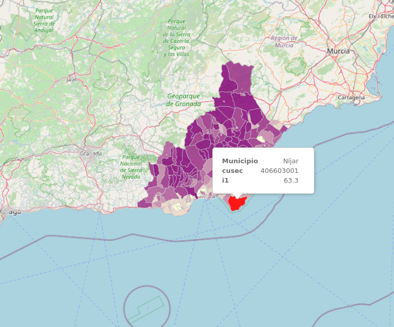
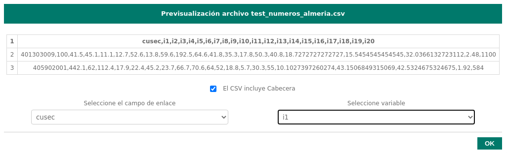
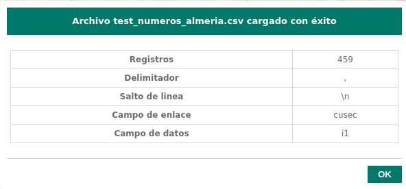
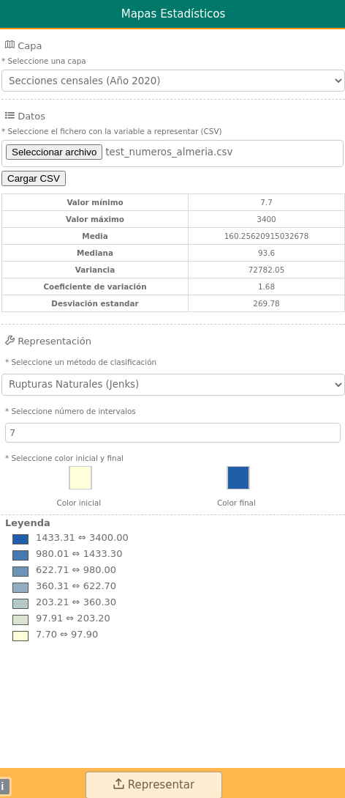
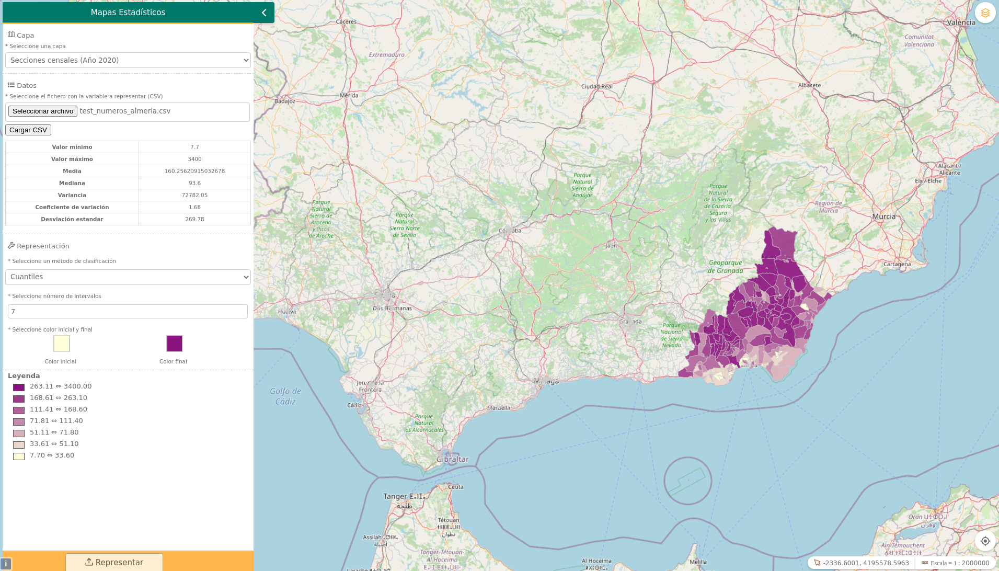

# Geostats

[](https://github.com/sigcorporativo-ja/Mapea4-dev-webpack)

## Descripción

 Plugin de [Mapea](https://github.com/sigcorporativo-ja/Mapea4) para la carga de variables estadísticas y su representación en un mapa mediante capas Vector Tiles. 

 El fichero CSV debe tener un identificador unívoco que relacione la variable con el objeto espacial por ejemplo código municipal, código provincial o código seccion censal.

 
 
 ## Uso
 
 Salvo el selector de capas todos los input se encuentran deshabilitados hasta que no se ha completado o selecionado los datos previos para su uso

 Los pasos necesarios para la la visualización final de la información estadística serian los siguientes:

 1. Se selecciona la capa de información espacial con la cual se quiere enlazar los datos.
 2. Se carga el fichero csv.
 3. Se informa si el csv posee cabecera o no.
 4. Se define el campo de enlace o identificador único y la variable a representar.
 5. Se selecciona metodo de representación, número de intervalos y colores.
 6. Se representa la información.
 
 

 Mediante configuración del plugin, o leyéndolo del WMC, pueden establecerse una serie de mapas base que se mostrarán de la siguiente manera.   

 

 También pueden predefinirse capas, así como su agrupación, que estáran disponibles para el usuario a través de la pestaña de "Favoritas"

 

 

 

 


## Recursos y configuración

- js: geostats.ol.min.js
- css: geostats.min.css


```
//objeto configurador del plugin
let vectorTileLayers = [
  {
    year: "Secciones censales (Año 2000)",
    service: "http://localhost:8080/data/secciones_censales_2000/{z}/{x}/{y}.pbf",
  },
  {
    year: "Secciones censales (Año 2001)",
    service: "http://localhost:8080/data/secciones_censales_2001/{z}/{x}/{y}.pbf",
  },
  {
    year: "Secciones censales (Año 2002)",
    service: "http://localhost:8080/data/secciones_censales_2002/{z}/{x}/{y}.pbf",
  },
  {
    year: "Secciones censales (Año 2003)",
    service: "http://localhost:8080/data/secciones_censales_2003/{z}/{x}/{y}.pbf",
  },
  {
    year: "Secciones censales (Año 2004)",
    service: "http://localhost:8080/data/secciones_censales_2004/{z}/{x}/{y}.pbf",
  },
  {
    year: "Secciones censales (Año 2005)",
    service: "http://localhost:8080/data/secciones_censales_2005/{z}/{x}/{y}.pbf",
  },
  {
    year: "Secciones censales (Año 2006)",
    service: "http://localhost:8080/data/secciones_censales_2006/{z}/{x}/{y}.pbf",
  },
  {
    year: "Secciones censales (Año 2007)",
    service: "http://localhost:8080/data/secciones_censales_2007/{z}/{x}/{y}.pbf",
  },
  {
    year: "Secciones censales (Año 2008)",
    service: "http://localhost:8080/data/secciones_censales_2008/{z}/{x}/{y}.pbf",
  },
  {
    year: "Secciones censales (Año 2009)",
    service: "http://localhost:8080/data/secciones_censales_2009/{z}/{x}/{y}.pbf",
  },
  {
    year: "Secciones censales (Año 2010)",
    service: "http://localhost:8080/data/secciones_censales_2010/{z}/{x}/{y}.pbf",
  },
  {
    year: "Secciones censales (Año 2011)",
    service: "http://localhost:8080/data/secciones_censales_2011/{z}/{x}/{y}.pbf",
  },
  {
    year: "Secciones censales (Año 2012)",
    service: "http://localhost:8080/data/secciones_censales_2012/{z}/{x}/{y}.pbf",
  },
  {
    year: "Secciones censales (Año 2013)",
    service: "http://localhost:8080/data/secciones_censales_2013/{z}/{x}/{y}.pbf",
  },
  {
    year: "Secciones censales (Año 2014)",
    service: "http://localhost:8080/data/secciones_censales_2014/{z}/{x}/{y}.pbf",
  },
  {
    year: "Secciones censales (Año 2015)",
    service: "http://localhost:8080/data/secciones_censales_2015/{z}/{x}/{y}.pbf",
  },
  {
    year: "Secciones censales (Año 2016)",
    service: "http://localhost:8080/data/secciones_censales_2016/{z}/{x}/{y}.pbf",
  },
  {
    year: "Secciones censales (Año 2017)",
    service: "http://localhost:8080/data/secciones_censales_2017/{z}/{x}/{y}.pbf",
  },
  {
    year: "Secciones censales (Año 2018)",
    service: "http://localhost:8080/data/secciones_censales_2018/{z}/{x}/{y}.pbf",
  },
  {
    year: "Secciones censales (Año 2019)",
    service: "http://localhost:8080/data/secciones_censales_2019/{z}/{x}/{y}.pbf",
  },
  {
    year: "Secciones censales (Año 2020)",
    service: "http://localhost:8080/data/secciones_censales_2020/{z}/{x}/{y}.pbf",
  },
];

const mp = new Geostats(vectorTileLayers);
map.addPlugin(mp);
```