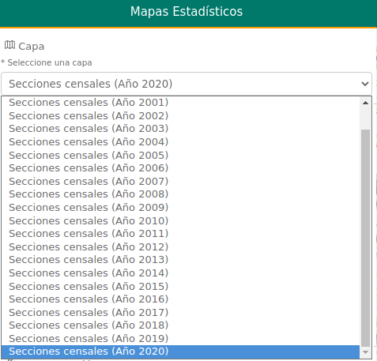

# Geostats

[](https://github.com/sigcorporativo-ja/Mapea4-dev-webpack)

## Descripción

 Plugin de [Mapea](https://github.com/sigcorporativo-ja/Mapea4) para la carga de variables estadísticas y su representación en un mapa mediante capas Vector Tiles. 

 El fichero CSV debe tener un identificador unívoco que relacione la variable con el objeto espacial por ejemplo código municipal, código provincial o código seccion censal.

 
 
 ## Uso
 
 Salvo el selector de capas todos los input se encuentran deshabilitados hasta que no se hayan completado los pasos previos necesarios.

 Los pasos necesarios para la la visualización final de la información estadística serian los siguientes:

 1. Se selecciona la capa de información espacial con la cual se quiere enlazar los datos.
      

 2. Se selecciona el fichero csv que posee la información. El plugin hace una precarga donde se muestran las tres primeras lineas. En este momento será necesario especificar si el csv posee cabecera y cuales son los campo de enlace o identificador único y la variable a representar.

      

 3. Una vez definidos los parámetros de carga se analizará el CSV completo. En caso de que el fichero posea errores o este mal formado se mostrará un popup con los errores detectados. 
 
    En caso contrario se mostrara un popup con los datos básicos obtenidos tras la carga del fichero tales como número de registros, delimitador, caracter de salto de linea, campo de enlace y campo de variable de representación.

      
 
      


 4. Tras la finalización de la carga y para facilitar la selección del método de clasificación. Se muestran los datos descriptivos básicos de la variable selecionada.

      - valor mínimo.
      - valor máximo.
      - media.
      - mediana.
      - variancia.
      - coeficiente de variación.
      - desviación estandar. 

      

 5. Selección del método de clasificación. los métodos definidos actualmente en el plugin son:

      - Valores úncios.
      - Intervalos iguales.
      - Cuantiles.
      - Desviación estandar.
      - Progresión aritmética.
      - Progresion geométrica.
      - Rupturas Naturales (Jenks).


      

 
 
 6. Selección de número de intervalos. Tras seleccionar el método de clasificación se puede definir un número de itervalos. Por defecto vienen definidos 5 intervalos.

      ***En caso de haberse selecionado valores úncios en el método de clasificación se deshabilita la selección de número de intervalos.***

 7. Selección de color inicial y color final de los intervalos. EL plugin permite difinir un color inicial y un color final para crear una rampa de color.

      Automaticamente se definirá la leyenda mostrando la rampa de color y los valores de corte de cada rango.

      ***En caso de haberse selecionado valores úncios en el método de clasificación se deshabilita la selección de color inicial y color final.***


      ***La leyenda es dinámica por lo que cualquier modificación en el metodo de clasificación, intervalos colores se verán reflejados de manera automática en esta***

      

   8. Para finalizar con el proceso se deberá hacer clic en el botón ***Representar*** que se encuentra en la parte inferior del panel.

      El resultado final es la representación de la variable seleccionada según el método de clasificación, rangos y rampa de color. 

      ***Tanto los datos del csv como los elementos de la capa de información espacial que no han podido ser enlazados no se representan en el mapa.***      

      

 
 9. Consulta de Información. Para poder consultar la información del fichero csv asociada a la capa en el visor solo es necesario pasar el raton por encima de cada elemento. Automáticamente se resaltara en rojo la geometría o elemento selecionado y se mostrará un popup con la información alfanumérica asociada.
      

## Recursos y configuración

- js: geostats.ol.min.js
- css: geostats.min.css


```javascript
//el plugin por defecto toma como identificador único de cada feature el atributo id
//objeto configurador del plugin
let vectorTileLayers = [
  {
    year: "Secciones censales (Año 2000)",
    service: "http://localhost:8080/data/secciones_censales_2000/{z}/{x}/{y}.pbf",
  },
  {
    year: "Secciones censales (Año 2001)",
    service: "http://localhost:8080/data/secciones_censales_2001/{z}/{x}/{y}.pbf",
  },
  {
    year: "Secciones censales (Año 2002)",
    service: "http://localhost:8080/data/secciones_censales_2002/{z}/{x}/{y}.pbf",
  },
  {
    year: "Secciones censales (Año 2003)",
    service: "http://localhost:8080/data/secciones_censales_2003/{z}/{x}/{y}.pbf",
  },
  {
    year: "Secciones censales (Año 2004)",
    service: "http://localhost:8080/data/secciones_censales_2004/{z}/{x}/{y}.pbf",
  },
  {
    year: "Secciones censales (Año 2005)",
    service: "http://localhost:8080/data/secciones_censales_2005/{z}/{x}/{y}.pbf",
  },
  {
    year: "Secciones censales (Año 2006)",
    service: "http://localhost:8080/data/secciones_censales_2006/{z}/{x}/{y}.pbf",
  },
  {
    year: "Secciones censales (Año 2007)",
    service: "http://localhost:8080/data/secciones_censales_2007/{z}/{x}/{y}.pbf",
  },
  {
    year: "Secciones censales (Año 2008)",
    service: "http://localhost:8080/data/secciones_censales_2008/{z}/{x}/{y}.pbf",
  },
  {
    year: "Secciones censales (Año 2009)",
    service: "http://localhost:8080/data/secciones_censales_2009/{z}/{x}/{y}.pbf",
  },
  {
    year: "Secciones censales (Año 2010)",
    service: "http://localhost:8080/data/secciones_censales_2010/{z}/{x}/{y}.pbf",
  },
  {
    year: "Secciones censales (Año 2011)",
    service: "http://localhost:8080/data/secciones_censales_2011/{z}/{x}/{y}.pbf",
  },
  {
    year: "Secciones censales (Año 2012)",
    service: "http://localhost:8080/data/secciones_censales_2012/{z}/{x}/{y}.pbf",
  },
  {
    year: "Secciones censales (Año 2013)",
    service: "http://localhost:8080/data/secciones_censales_2013/{z}/{x}/{y}.pbf",
  },
  {
    year: "Secciones censales (Año 2014)",
    service: "http://localhost:8080/data/secciones_censales_2014/{z}/{x}/{y}.pbf",
  },
  {
    year: "Secciones censales (Año 2015)",
    service: "http://localhost:8080/data/secciones_censales_2015/{z}/{x}/{y}.pbf",
  },
  {
    year: "Secciones censales (Año 2016)",
    service: "http://localhost:8080/data/secciones_censales_2016/{z}/{x}/{y}.pbf",
  },
  {
    year: "Secciones censales (Año 2017)",
    service: "http://localhost:8080/data/secciones_censales_2017/{z}/{x}/{y}.pbf",
  },
  {
    year: "Secciones censales (Año 2018)",
    service: "http://localhost:8080/data/secciones_censales_2018/{z}/{x}/{y}.pbf",
  },
  {
    year: "Secciones censales (Año 2019)",
    service: "http://localhost:8080/data/secciones_censales_2019/{z}/{x}/{y}.pbf",
  },
  {
    year: "Secciones censales (Año 2020)",
    service: "http://localhost:8080/data/secciones_censales_2020/{z}/{x}/{y}.pbf",
  },
];

const mp = new M.plugin.Geostats(vectorTileLayers);
map.addPlugin(mp);
```

## Video Demo

Para comprobar el funcionamiento de este plugin se puede descargar el 
[Video](https://github.com/emiliopardo/geostats/blob/master/docs/video/geostats.mov?raw=true) el cual contempla cada unod e los pasos descritos en esta página

## Generación MVT

Para la generación de servicios de mapas en formato MVT se puede seguir el siguiente tutorial [Creación servicio de mapas MVT](https://github.com/emiliopardo/mvt_secciones_censales)
